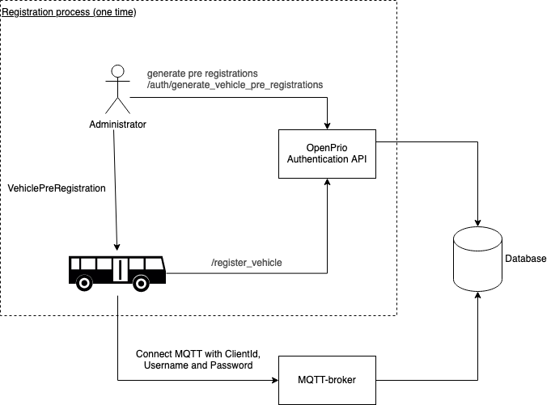

# OpenPrio authentication

OpenPrio uses MQTT to communicate between the vehicle and a central server that distributes the messages to third parties. It's important that the central server only distributes messages from real vehicles, because one of the usecases of OpenPrio is granting priority to Public Transport. Therefor some authentication and authorization is needed. This document describes how the authentication and authorization process works. 

## General introduction

OpenPrio works with the assumption that a vehicle can be uniquely identified by combining two keys, the data_owner_code (describes an operator uniquely) and the vehicle_number (a unique number for a vehicle within an operator). Every vehicle can get exactly one credential to create one connection with the MQTT broker, if you try to open a second connection with the same credentials it will terminate the first connection. The authorization and authentication system is designed with the usage of a OBC (on-board computer) in mind. It works with distributing pre-registrations for vehicles to operators, the operator should make sure that the pre-registration is distributed to the right vehicle. The OBC of the vehicle is responsibble for exchanging the pre-registration for a registration and making sure that this registration is stored locally. The OBC of the vehicle is the only place where this credentials should be stored. 

### Flow


1. Pre-registering vehicles
The operator communicates to the administrator of OpenPrio that the operator want to register vehicles in a certain range, for example: 3000-3049,3052,3060-3080,4001-4072,5001-5070. The operator receives a JSON and .csv that contains the pre-registrations consisting of data_owner_code, vehicle_number and token, see example below.

```json
[
    {
        "data_owner_code": "HTM",
        "vehicle_number": "5001",
        "token": "<token>",
        "created_at": "2022-10-10T11:14:06+02:00"
    },
    {
        "data_owner_code": "HTM",
        "vehicle_number": "5002",
        "token": "<token>",
        "created_at": "2022-10-10T11:14:06+02:00"
    },
    {
        "data_owner_code": "HTM",
        "vehicle_number": "5070",
        "token": "<token>",
        "created_at": "2022-10-10T11:14:06+02:00"
    }
]
```

2. Distributing pre-registrations to vehicles

The operator should distribute the pre-registrations of the vehicles to the OBC's of the vehicles. This can be done manually, but preferably in an automatic way. 

3. Exchanging pre-registration for registration

When a vehicle receives a new pre-registration it should exchange the pre-registration for a final registration by making an HTTP-call to the the /register_vehicle endpoint. 

```bash
curl --location --request POST 'https://api.openprio.nl/register_vehicle' \
--header 'Content-Type: application/json' \
--data-raw '{
        "data_owner_code": "HTM",
        "vehicle_number": "5070",
        "token": "<token>"
    }'
```
In return it receives a client_id, username and token it can uses to connect with MQTT, this credentials should be stored parmanently on the OBC. 

```json
{
    "client_id": "<client_id>",
    "username": "<username>",
    "token": "<token>"
}
```

4. Connecting with MQTT-broker

With the aquired credentials you can connect with the OpenPrio MQTT broker, the MQTT broker is reachable on mqtt.openprio.nl:8883. The following topics can be used. 

publish (to send position, data is expected in the following format https://github.com/openprio/specification/blob/master/openprio_pt_position_data.proto):
- /prod/pt/position/<data_owner_code>/vehicle_number/<vehicle_number>
- /test/pt/position/<data_owner_code>/vehicle_number/<vehicle_number>

subscribe (to receive feedback from TLC, data can be expected in the following format https://github.com/openprio/specification/blob/master/ssm.proto):
- /prod/pt/ssm/<data_owner_code>/vehicle_number/<vehicle_number>
- /test/pt/ssm/<data_owner_code>/vehicle_number/<vehicle_number>


